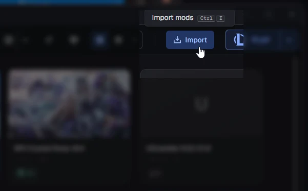
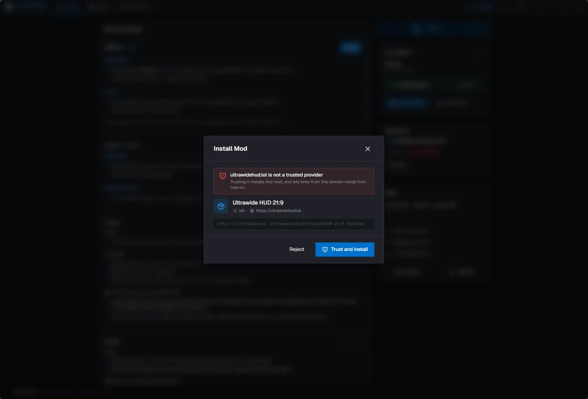
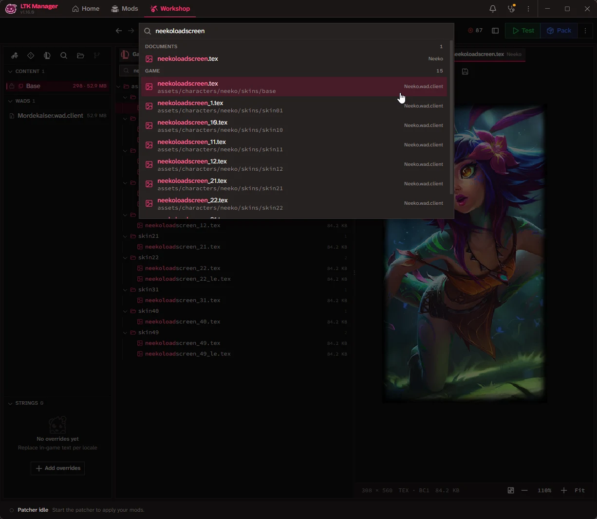
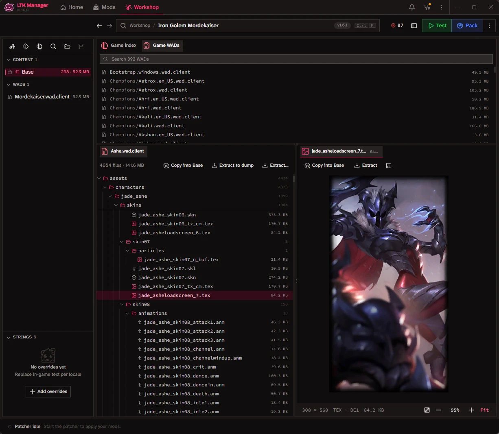

  
  <h1>LTK Manager</h1>

LTK Manager is the frontier mod manager for League of Legends. Install custom skins, HUDs, maps, audio and much more.
One of the main goals is to support mods so they work indefinitely without breaking between patches. It is the
[League Toolkit](https://github.com/LeagueToolkit) team's successor to [cslol-manager](https://github.com/LeagueToolkit/cslol-manager).

If you make mods, the built-in **Workshop** is where you browse the game's files, edit your mod
and pack it, without leaving the window.

**[Download](#download)** · **[Install a mod](#install-a-mod)** · **[Features](#features)** ·
**[Make your own mods](#make-your-own-mods)** · **[Help](#help)**

## Download

1. Get the latest installer from the [Releases page](https://github.com/LeagueToolkit/ltk-manager/releases/latest).
   The `.msi` is the recommended one.
2. Run it and open **LTK Manager**.
3. On first launch the app looks for your League of Legends installation. If it cannot find
   it, pick the game folder yourself.

After that, updates take care of themselves. The app checks for new versions and shows you what
changed before it updates.

LTK Manager runs on **Windows 10 and 11** (64-bit). macOS and Linux are planned, but not
available yet.

## Install a mod

1. Download a mod as a `.modpkg` or `.fantome` file.
2. Drag it onto the LTK Manager window, or press **Import** (`Ctrl+I`) and pick the file.
3. Turn the mod on and press **Start**. Then launch League the way you always have, and your
   mods are in the game.

  
  
<em>Import sits on the library toolbar and takes a <code>.modpkg</code> or <code>.fantome</code> file.</em>

| Format     | What it is                                                                                             |
| ---------- | ------------------------------------------------------------------------------------------------------ |
| `.modpkg`  | The League Toolkit mod package. Carries the mod's details, a thumbnail and layers. The recommended one |
| `.fantome` | The older Fantome format. Recognized and installed the same way                                        |

### Install from a link

A mod site can offer an **Install with LTK Manager** button. Clicking it opens the app and
installs the mod for you. The first time a link comes from a site you have not used before, the
app asks before it trusts the site.

  
  
<em>A link from a new site asks first. Trusting the site lets its links install from then on.</em>

The sites you trust are listed under **Settings > Library**, where you can remove one again.

## Launching League

Out of the box, **Start** runs the patcher and nothing else. You launch League from the Riot
Client as usual, and the patcher applies your mods when the game loads. This is the flow every
cslol-manager user knows, and it depends on nothing outside the app.

Switch **Launcher flow** to **Modern** under **Settings > General** and the button becomes
**Play**. One press builds your mods, starts the patcher and asks the Riot Client to launch
League. The status bar follows each step, so a Riot Client that takes a few seconds to appear
never looks like a hang, and it keeps following the game once it is up. The menu beside Play
launches League on its own, without patching, and closes the game through the Riot Client while
one is running.

Two settings go with the Modern flow:

- **Hide Riot Client on game start** sends the client's window to the tray once the game is up.
- **Stop the patcher when the game ends** stops it with the game. It is off by default, so you
  can play several games in a row on one patch.

The Modern flow is still marked experimental. When the Riot Client refuses a launch, the app
says why and what to do, and Classic is one setting away.

## Features

- **Mod library** - Your mods as cards you can search, sort into folders and drag to reorder.
  One switch turns a mod on or off.
- **Profiles** - Keep several sets of mods and switch between them.
- **Mod health** - Each mod is checked when it arrives and again after a game patch. What can
  be repaired is repaired with one press. What cannot says so, so you know to look for a
  replacement instead of finding out in game.
- **Launching** - Start the patcher and launch League yourself, or let one **Play** button do
  the whole thing through the Riot Client. See [Launching League](#launching-league). Teamfight
  Tactics can be patched too.
- **Home** - A notice when a game patch breaks something, news from the project, and the
  release notes of the version you are on.
- **Diagnostics** - A page of checks on your machine and your game install, for when something
  goes wrong.
- **Appearance** - Dark and light themes, your own accent color, an optional backdrop image, and
  a tray mode that starts with Windows.

## Make your own mods

The **Workshop** is an editor for mod projects, built into the same window. Open a project, read
what it holds, change what it declares, test it in game and pack it.

- **Browse the game** - Every archive of your installed game as a file tree, with nothing
  extracted. Open textures and property files in preview tabs, copy a file straight into your
  mod, or extract it to disk.
- **Find any game file** - Press `Ctrl+P` and type a name. The search covers every file of the
  installed game and of your project, and `$` searches the objects declared inside the game's
  property files.
- **Bin editor** - Opens a `.bin` as a tree of typed values rather than as text, with field names
  resolved and the class documentation from the
  [meta wiki](https://meta-wiki.leaguetoolkit.dev/) a click away.
- **String overrides** - Replace in-game text per language, in a table.
- **Problems** - Checks the project for what the game will refuse, such as a texture size or a
  property type the current patch no longer accepts, and fixes what can be fixed.
- **Test and Pack** - Test runs the project in game without packing it. Pack writes a `.modpkg`
  that is ready to share.
- **Import** - Bring in a `.fantome`, a `.modpkg` or a Git repository as a project.

  
  
<em>One search box reaches every file of the installed game.</em>

  
  
<em>Game archives open as file trees, and a texture opens as a tab.</em>

## Help

- **Discord** - [discord.gg/yhzDVRyQex](https://discord.gg/yhzDVRyQex) is where to ask
  questions and find mods.
- **Wiki** - [wiki.leaguetoolkit.dev](https://wiki.leaguetoolkit.dev) has guides on installing
  and making mods.
- **Found a bug?** - [Open an issue](https://github.com/LeagueToolkit/ltk-manager/issues/new/choose).
  The app writes a log at `%APPDATA%\dev.leaguetoolkit.manager\logs\ltk-manager.log`, and
  attaching it helps.
- **Other tools** - [awesome-league](https://github.com/LeagueToolkit/awesome-league) lists the
  tools and libraries for working with League files.

### Before you install

- **Use at your own risk.** LTK Manager is not endorsed by or affiliated with Riot Games.
- **Servers** - Riot-operated servers are supported. Asian servers and Garena are not officially
  supported and may run into issues.

## License

LTK Manager is free software under the
[GNU General Public License v3.0 or later](LICENSE).

The bundled patcher binaries are covered by the [LTK Patcher License](LTK-PATCHER-LICENSE.md).
If you want to reuse them in a tool of your own, [CONTRIBUTING.md](CONTRIBUTING.md) has the
short version.

## Contributing

Contributions are welcome. [CONTRIBUTING.md](CONTRIBUTING.md) covers how to report a bug, how to
build the app from source and how the project is organized.

---

Developed by the **[League Toolkit](https://github.com/LeagueToolkit)** organization.
