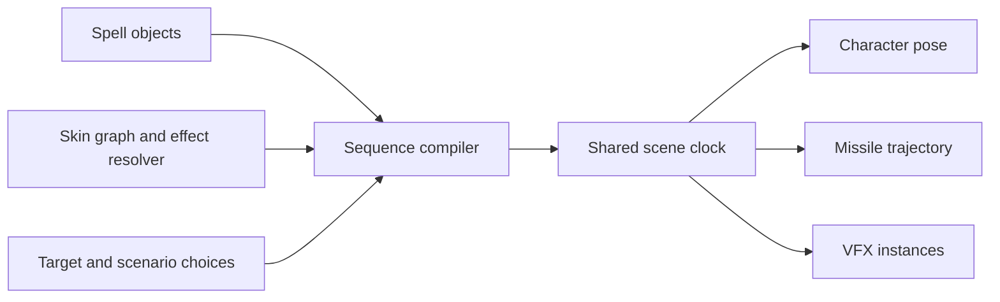

# Ability preview

Draft implementation plan, 2026-09-15.

A character preview with a spell picker, a movable target and a Cast action. One clock plays
the character animation, attached effects, missile flight and impact. A sequence can combine
several spells where the ability needs them.

## Implementation status

Stage 1 is implemented for the installed game's object index. The skin shell has a Spells pane
with character discovery, path groups and filtering. Existing layouts open it from the Panes
menu. New layouts place it beside Clips. The pane shows only this character's spells, checks
support before enabling each row, and opens supported previews on one click. Unsupported and
conflicting spells stay disabled. Declaration files and install-wide unknown-name counts stay
out of the pane. Project overrides are not yet part of the catalog.

The supplied Sejuani path and its eight-spell group were inspected in the installed 16.18 build.
The findings and next playback gates are in
[Sejuani spell fixtures](../research/sejuani-spell-fixtures.md).

Stage 2 is implemented as an isolated missile preview inside the Spells pane. A selected
declaration supplies its written fixed speed or fixed duration. Users set launch and target
points at a shared height. A unique flight-effect key resolves through the selected skin's
effect list, including linked documents. An unresolved key requires an explicit effect choice.
Playback waits for textures and meshes, uses seeded fixed steps for play and seek, and stops
emission at arrival while particles finish their tails.

This stage does not apply bone offsets, height solvers, facing components, team variants,
spell-local resolvers or arrival actions. Written unsupported fields remain visible. Missing
or invalid movement blocks playback. Launch plus flight is limited to 30 seconds, and the
whole preview to 60 seconds with a visible tail-limit notice. Stage 3 adds character casting.
Stages 3-5 remain unimplemented.

## Scope and evidence

The first release covers a stationary caster, a stationary target, one supported missile and
its resolved visual effects. Playback has pause, restart, speed and seeking. Multi-spell
sequences follow once one cast is reliable. Audio, combat simulation and arbitrary spell script
execution are separate work.

The goal is an ability's visual sequence. The data inspected so far does not establish that
every ability's complete runtime behavior can be reconstructed automatically. The preview must
identify missing dependencies and unsupported behavior instead of presenting partial playback
as complete.

Code was inspected in this checkout. Schema facts were queried with `@leaguetoolkit/meta-cli@1`,
including inherited fields, with targeted queries pinned to patch 16.17. The service reported
dataset generation `2026-08-24T03:56:00Z`. These are schema facts, not observations of Sejuani's
shipped values. The later fixture report above records the installed assets separately.

The [MissileSpecification wiki page](https://meta-wiki.leaguetoolkit.dev/classes/missilespecification/)
could not be opened through the browser. The CLI returned its schema successfully and reported
no written documentation. Field names alone do not prove timing precedence, units or runtime
semantics. Stage 1 verifies those against actual assets and observed playback.

## Existing pieces

| Area              | Existing implementation                                      | Reuse                                                         |
| ----------------- | ------------------------------------------------------------ | ------------------------------------------------------------- |
| Discovery         | `ObjectIndex::object_dir`, `object_index/browse.rs`          | Segment-aware browsing with declarations and nested objects   |
| Search            | `ObjectIndex::find`, `object_index/find.rs`                  | Class filtering and explicit result counts and caps           |
| Skin resolution   | `resolve_skin`, `search_linked_systems`, `skin/mod.rs`       | Skin assets, effect keys, linked systems and asset provenance |
| Animation         | `resolve_graph`, `skin/mod.rs`                               | Clip references, events, tracks, masks and parameters         |
| Scene             | `skin/components/SkinViewport.tsx`                           | Character, shared `SceneClock`, pose and existing transport   |
| Animation effects | `skin/utils/clipEvents.ts`, `skin/components/ClipEffect.tsx` | Timed particle cues, bone attachment and seeded drivers       |
| Motion            | `vfx/engine/model/rig.ts`                                    | Time-sampled anchors, path motion, lifecycle and stop time    |
| VFX reads         | `vfx/hooks/useVfxSystem.ts`                                  | Cached document-scoped reads of resolved systems              |

Rust paths above are under `crates/ltk-manager-core/src/`. Frontend paths are under
`src/modules/workshop/bin/`.

The current particle cue reader skips kill events and unmapped effect keys. Ability playback
needs explicit stop events and diagnostics for unresolved keys. Existing graph playback also
needs a capability audit before a graph branch is called supported. Reading a graph's fields
does not mean the player evaluates every selector, transition or blend.

## 1. Spell discovery

Start from `Characters/{name}/Spells` in the object index. Traverse prefixes and objects that
have descendants, including folded prefixes. An object can also be a parent. Use an internal
prefix enumeration if repeated directory calls become costly, built on the existing path index.
Ranked search is not an exhaustive discovery API, and capped find results must not silently
truncate the catalog.

For each candidate, preserve object hash, resolved path, class and all declaring assets. Verify
the declaration's class and read `SpellObject.mSpell` as `SpellDataResource`. Load details on
selection rather than decoding every character's spells at startup.

Group by the first segment below `Spells` when present. In the supplied example:

```
Characters/Sejuani/Spells
|-- SejuaniEAbility
|   |-- SejuaniEPassiveMissile
```

`SejuaniEAbility` is a discovery group. It is not evidence that all children run together, or
that their path order is cast order. Keep flat spells, ungrouped entries and unresolved names
available. Identify Q/W/E/R or passive slots only when character data or a saved mapping supports
the association.

Resolve dependencies in the selected project and skin context using the editor's asset lookup
rules. Include project declarations and open document revisions so modified spells can be
previewed. Preserve alternate declarations instead of choosing the first match from the global
index. Reuse existing precedence where defined, and expose ambiguity where it is not.

Cache discovery by game build, object-index generation and project context. Cache resolved
previews by their document and dependency revisions, selected skin and schema build. Missing
names or a building index must remain distinct from a character having no spells.

## 2. Spell projection

Add a focused core module at `crates/ltk-manager-core/src/spell/`, with a thin command adapter
under `src-tauri/src/commands/`. Rust reads and resolves assets. TypeScript evaluates playback.
This follows the existing boundary in `docs/plans/vfx-particle-renderer.md`.

The verified schema provides these inputs:

| Source                 | Fields                                                                                    | Proposed use                                              |
| ---------------------- | ----------------------------------------------------------------------------------------- | --------------------------------------------------------- |
| `SpellObject`          | `mSpell`, `Script`, `mScriptName`                                                         | Spell payload and script provenance                       |
| `SpellDataResource`    | `mAnimationName`, `mAnimationLoopName`, `mAnimationLeadOutName`, `mAnimationWinddownName` | Candidate cast phases in the selected skin's graph        |
| `SpellDataResource`    | `mCastTime`, `castFrame`, `spellCastTime`, `spellTotalTime`, `useAnimatorFramerate`       | Timing inputs whose precedence requires verification      |
| `SpellDataResource`    | `mMissileEffectKey`, player/enemy variants, effect names                                  | Flight effect resolution                                  |
| `SpellDataResource`    | `mHitEffectKey`, player variant, effect names, `mHitBoneName`, `mHitEffectOrientType`     | Impact effect and attachment                              |
| `SpellDataResource`    | `mResourceResolvers`, `mParticleStartOffset`                                              | Resolver context and origin offset                        |
| `SpellDataResource`    | `mTargetingTypeData`, cast ranges and radii                                               | Target setup and optional guides                          |
| `SpellDataResource`    | `mMissileSpec`                                                                            | `Pointer<MissileSpecification>`                           |
| `MissileSpecification` | `movementComponent`, `heightSolver`, `verticalFacing`                                     | Trajectory and orientation inputs                         |
| `MissileSpecification` | `behaviors`, `missileGroupSpawners`, `visibilityComponent`, `mMissileWidth`               | Lifecycle, additional spawns, visibility and width inputs |
| `MissileMovementSpec`  | `mStartBoneName`, `mStartBoneSkinOverrides`, `mStartDelay`                                | Launch anchor and delay                                   |
| `MissileMovementSpec`  | `mTracksTarget`, `mTargetBoneName`, height-related fields                                 | Target sampling and height                                |
| `FixedSpeedMovement`   | `mSpeed`                                                                                  | Constant-speed trajectory                                 |
| `FixedTimeMovement`    | `mTravelTime`                                                                             | Fixed-duration trajectory                                 |
| `AcceleratingMovement` | `mInitialSpeed`, `mAcceleration`, `mMinSpeed`, `mMaxSpeed`                                | Later acceleration support                                |

These are candidate semantics for playback, subject to fixture verification. In particular,
`mMissileWidth` must not become VFX scale without evidence, and movement-specific speed must not
be overwritten by the separate `SpellDataResource.missileSpeed` field.

Return a bounded projection with spell identity, animation references, effect references,
missile description, source locations and diagnostics. Keep omitted values distinct from
explicit zero and record when a schema default was applied. Unknown classes retain their
identity and inspector location. They do not silently become straight-line motion.

Resolve effect keys through the selected skin and spell resource context. Reuse the existing
key-to-system resolver and linked-document machinery. Verify resolver precedence, team variants
and name fallbacks in fixtures before treating them as automatic. Never equate an effect-key
hash with a system-object hash.

Backend interfaces reuse `BinDocumentId`, `BinHash` and `AssetRef`. Domain states use enums,
and malformed input produces typed errors or per-feature diagnostics. Validate finite timing
and motion inputs at the boundary. Follow the repository's public wire-struct convention,
derive `Debug` and generated IPC traits, and document public APIs. This applies the
[Rust API Guidelines](https://rust-lang.github.io/api-guidelines/checklist.html) and
[Microsoft Pragmatic Rust Guidelines](https://microsoft.github.io/rust-guidelines/).

## 3. Cast sequence

Introduce three conceptual models, with final names settled during implementation:

- **Spell preview**: resolved spell facts and their sources
- **Cast scenario**: caster, skin, target, rank, seed, branch choices and explicit overrides
- **Cast sequence**: scheduled animation, effect and missile instances for that scenario

A pure compiler combines the preview and scenario into a sequence. Each action carries its
source and whether it was derived, manually configured or remains unresolved. The basic flow is:



At cast start, play the resolved animation and its particle cues. At the verified release time,
sample the launch bone, apply the verified offset convention and create a missile instance.
On arrival, stop its emission, let its configured tail finish and start the supported impact
effects at the target. Winddown and idle resume independently of missile lifetime.

There is no universal timing formula in this draft. Establish the relationship between cast
fields, animation frames and `mStartDelay` with real data before implementing one. A field that
names an animation does not prove that a passive child spell plays that animation when spawned.
The sequence distinguishes casting a spell from spawning one of its missiles.

Use one clock for all systems. Give every action a stable instance id and a seed derived from
the scenario seed and action id. Asset loading finishes before time advances, so a late texture
or linked document cannot change launch time.

Seeking resets and deterministically replays stateful simulation in fixed steps. Pure pose and
trajectory sampling use the same times. Add checkpoints only if measured seek cost needs them.
An impact crossed during a long frame fires once. Backward seeks, loops and replay reconstruct
the same instances and stop events. The sequence's end includes the final effect tail, not just
the animation duration.

Bound effect instances, recursive child spawns, traversal depth and preview duration. Report a
limit as incomplete playback. Changes to resolved assets or scenario inputs rebuild the affected
sequence and replay to the current time once dependencies are ready.

## 4. Missile trajectories and rig integration

Keep the existing still, path and bone rigs. Add a trajectory-backed motion adapter only where
spell motion needs it. It supplies position, basis, arrival time and stop events to the existing
VFX driver. A moving missile owns a world-space transform after launch. Its origin must not keep
following the caster's hand.

Start with `FixedSpeedMovement` and `FixedTimeMovement` against a fixed target. Verify height
solver and facing combinations before including them in the supported set. Represent source
and target anchors separately, even when the target initially has no skeleton.

Use the viewport's existing engine-space conversion and current missile basis. Test skin scale,
offset space and bone transforms together. The renderer plan records several superseded frame
assumptions, so copying an earlier formula from that document would regress orientation.

Target tracking, acceleration, splines, circles, return paths and group spawns are later adapters
selected by actual class and supported parameters. A schema subclass existing is not proof its
runtime behavior is understood. Unsupported motion is shown explicitly, with an optional manual
trajectory that remains marked as an approximation.

## 5. Editor interaction

Add an Abilities view beside the existing character animation controls, sharing the skin scene.
An object-browser action can also open a spell preview in a selected character and skin context.

The first interaction is select spell, position target and press Cast. The viewport shows the
caster and target, while the transport provides replay, pause, speed and scrubbing. A compact
timeline shows animation, launch, flight and impact. Selecting an event opens its source field
or graph clip in the existing inspector.

Discovery groups unfold to their component spells. A component can be previewed alone even when
the full ability has no known sequence. Display missing effects, unsupported motion and manual
timing alongside the affected step. Allow the user to choose a clip or release time when those
cannot be resolved. A loaded effect without its required placement is not marked complete.

Keep fetched projections in TanStack Query and local scenario choices in module-owned state.
Use existing components, Paraglide messages and the design-system skill when implementing the UI.

## 6. Multiple spells

Extend the sequence with child actions triggered by cast, a named cue, missile arrival, an
explicit delay or a user-supplied scenario event. Support multiple simultaneous missiles without
starting duplicate character animations. Each spawned instance has its own lifecycle and target.

Follow explicit references and supported behavior metadata first. Path groups and similar names
only suggest candidates. Script references are useful evidence to inspect, but the initial
implementation does not execute scripts or claim to reproduce server decisions.

Where data leaves a gap, let users connect component spells and choose trigger conditions in
a small sequence editor. Save overrides as versioned editor metadata outside packaged game
content. Store stable asset and object identities, source build and overrides, not resolved
copies of game data or transient document handles. Revalidate saved connections after a patch.
Confirm the repository's metadata location when implementing persistence.

## Delivery stages and acceptance

| Stage                     | Deliverable                                                            | Acceptance                                                                                                          |
| ------------------------- | ---------------------------------------------------------------------- | ------------------------------------------------------------------------------------------------------------------- |
| 1. Evidence and discovery | Character spell catalog and fixture report                             | Sejuani's supplied path is found if present, all declarations are retained, grouping does not imply execution order |
| 2. Missile preview        | Resolved flight effect, launch/target anchors and supported trajectory | A verified fixed-speed or fixed-time fixture flies and stops correctly with repeatable seeking                      |
| 3. Virtual cast           | Animation, graph cues, release, flight and impact on one clock         | One verified complete fixture plays with matching timing and placement, missing dependencies remain visible         |
| 4. Ability sequence       | Triggered component spells and saved overrides                         | A verified multi-spell fixture replays with deterministic child spawns and no duplicate cast animation              |
| 5. Coverage               | Additional movement and behavior adapters                              | Each adapter has schema evidence, motion tests and an observed visual reference                                     |

Stage 1 extracts the supplied `SejuaniEPassiveMissile`, its siblings and relevant skin resources.
It records the actual movement class, animation names, effect keys, resolvers, timing fields and
script links. Choose a simple complete cast fixture based on these findings. If Sejuani's child
spell requires unavailable passive or script state, retain it as an isolated missile fixture and
use another verified spell for stage 3.

Before stage 3, settle timing precedence, effect resolver precedence, coordinate conventions and
the supported animation branches. These are implementation gates, not defaults to guess.

## Verification

- Discovery tests cover folded prefixes, objects with children, duplicate declarations, unknown names and result limits.
- Projection tests cover missing fields, explicit zero, schema defaults, linked files, cycles, unresolved keys and unsupported subclasses.
- Resolver tests use a base skin, a skin override and a project override, with provenance assertions.
- Motion tests cover launch delay, zero distance, invalid speed or duration, endpoint arrival, bone offsets, scale and basis.
- Sequence tests compare continuous playback with seek replay, frame skips, restart and looping at launch and impact boundaries.
- Lifecycle tests cover explicit kill events, emission stop, particle tails, simultaneous instances and canceled sequences.
- Visual checks compare a recorded reference at cast, release, mid-flight and impact for each supported fixture.
- Existing animation and standalone VFX previews keep their current behavior.

For implementation, run the affected crate tests, frontend tests, typecheck and formatting checks.
Rust changes also require clean `cargo fmt --check`, `cargo clippy --all-targets` and
`cargo doc --no-deps`. Regenerate IPC types when the command surface changes.

Stage 1 validation passed 69 backend object-index tests and 40 frontend catalog, shell-layout
and skin-view tests. IPC generation, typecheck, Rust formatting and workspace Clippy completed.
Rustdoc completed with warnings in unchanged modules. Frontend lint has the existing file-length
warning in `src/lib/tauri.ts`. The new pane has component coverage but has not had a native-app
visual check.

Stage 2 validation passed six Rust projection tests and 423 frontend tests covering the spell
pane, resolver selection, motion, VFX simulation and asset loading. The new reader was also
run against the installed Sejuani passive missile. It returned speed `5000`, target bone
`r_hand`, both written heights `100`, no flight-effect reference, and diagnostics for facing
and arrival behaviors. IPC generation, typecheck, formatting and workspace Clippy passed.
Rustdoc completed with the same 12 existing documentation warnings and dependency warnings.
The preview has not had a native-app visual check or an in-game timing comparison. Fixed-time
motion has synthetic coverage, with no installed fixed-time fixture verified yet.

The revised panel passed a browser check at 650px and 360px widths, in dark and light themes.
The check covered unsupported movement, collapsed settings, effect names and a synthetic
particle flight with play and pause. It caught and corrected a narrow-panel transport overlap.
The installed Galio Q missile uses `FixedSpeedSplineMovement`, verified with the meta CLI.
It remains unsupported and now has a specific movement state instead of a coordinate error.

The catalog interaction passed 20 spell tests and a browser check for direct preview navigation
and disabled unsupported rows. The support check groups reads by file, closes temporary document
handles and cancels remaining reads when the character changes.

The transport uses a measured particle endpoint instead of the maximum linger allowance.
An installed `Galio_Skin40_Q_MisSuper` projection with 45 emitters, previewed across 800 units at
speed 5000, measured 2.083 seconds against the previous 11.060-second allowance. The scan
includes child effects and retains the 60-second safety limit. Playback uses the same seed and
fixed steps as the scan. Clock writes no longer take their value from a stale React render,
and this timeline disables the shared slider's spring easing.

Transport regression tests cover particle exhaustion, launch delay and cancellation. A Chrome
check sampled 816 frames without backward clock motion, verified the fill against the clock,
and confirmed playback stops and replay restarts. The spell test suite passed 22 tests.

## Authored sequence slice

Implemented a character scene with one clock for an atomic animation, bone-attached cast effect,
optional straight flight and target impact. Each action has an explicit emission stop and a
stable seed. Backward seeks replay the same fixed steps. Playback ends after the final animation
or action and its live particles, with a 60-second limit. The character holds its final pose
during effect tails. Graph particle events and idle effects are excluded from recipe playback.

Recipes have their own version and live in the existing project editor file. The pane can create,
edit, preview, save, reopen and remove recipes for the current character. References are graph
clip hashes and skin resolver keys, with no persisted document handles. Missing references require
an explicit replacement.

The spell projection now preserves `mSpell.mAnimationName`, including absent and empty values.
The meta CLI confirmed `SpellDataResource.mAnimationName` as String at patch 16.18, build 8175716.
Installed Galio Q declares `Spell1` without a missile specification. Skin40's graph contains that
key as an `AtomicClipData`. Name lookup follows single-child wrappers, rejects cycles and leaves
branch selection to the user. No default attack animation is injected for missing spell data.

Validation includes seven Rust projection tests, 172 frontend spell, asset-readiness, persistence and editor-store
tests, TypeScript checking and scoped ESLint. The store retains its existing file-length warning.
Workspace Clippy and Rustdoc completed with existing dependency and documentation warnings.
A synthetic browser scene confirmed animation selection through a wrapper, cast/flight/impact
playback, a monotonic clock, measured completion, and save/reopen. The recipe pane was inspected
at 420px and 360px widths. These checks do not establish in-game timing or server fidelity.

## Spell suggestions

The projection preserves both cast-time fields, hit-effect references and enablement, the three
range sources, both radii, and cone angle and distance. Seven-value arrays retain rank zero.
The recipe uses rank one and exposes editable suggestions. Conflicting written cast times require
an explicit choice. Missile delay is separate from cast release and is optional in saved version-one
recipes, so existing recipes retain their timing.

Flight and hit effects resolve unique skin keys first, then exact resolver names or declared
system paths and leaf names. Ambiguous matches remain unselected. An explicit disabled hit effect
is not suggested. Impact-only spells can open in the ability scene. Range outlines are optional
and do not contribute to the playback duration.

Validation passed nine Rust projection tests and 182 focused frontend tests, including recipe
initialization, effect fallback, delayed launch, guide geometry and persistence. TypeScript,
scoped ESLint, Rust formatting and workspace Clippy passed. Rustdoc completed with the existing
12 documentation warnings and dependency warnings. The installed Galio Q projection returns
`spellCastTime` 0.25 and display range 825 while preserving the underlying 25000-unit ranges.
A synthetic Chrome check verified timing selection, delay and radius edits, rendered outlines,
and a 360px pane in dark and light themes without runtime errors. In-game fidelity remains
unverified.
